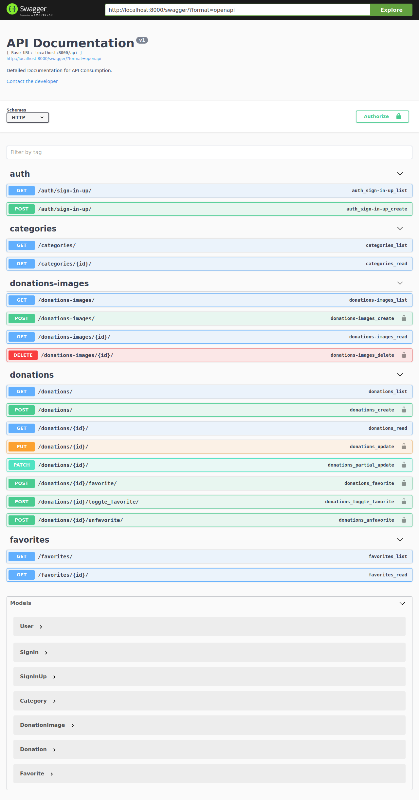

# Tem doação

An app used to donate things.

This repository contains the RestAPI source code to the **Tem doação** application. The API is served bellow the **/api** endpoint. This API contains an OpenAPI specification that can be accessed at **/swagger** endpoint, bellow is a swagger screenshot with the exposed endpoints.



## How to run the API
_The bellow steps will need that you just have the [**GIT**](https://git-scm.com), [**Python3.7**](https://www.python.org/) and [**pipenv**](https://github.com/pypa/pipenv) properly installeds._

0. Using the terminal, clone the repository.
```bash
git clone https://github.com/bgildson/tem_doacao_api
```
1. Navigate to the repository folder.
```bash
cd tem_doacao_api
```
2. Create/Activate virtualenv with pipenv.
```bash
pipenv shell
```
3. Install dependencies.
```bash
pipenv install
```
4. Copy the _.env.template_ as _.env_ in the root folder.
```bash
cp .env.template .env
```
5. Populate the variables containeds in the _.env_ file, each variable has a commented describing how to populate, like bellow example.
```bash
# key used to make token verifications and encrypt operations
SECRET_KEY=
# database stringconnection
# *if not informed, will use db.sqlite3 (suitable only for dev/tests environment)
DATABASE_URI=
# flag to indicate if the api is running in debug mode
DEBUG=
# hosts allowed to access the api, the default option could be ['*']
ALLOWED_HOSTS=

# flag variable used in the heroku service to indicate if 
# should run the collectstatic command when a new app version is deployed
# *ignored in local running
DISABLE_COLLECTSTATIC=

# variables to configure the api bucket, place where app images will be stored/serveds
# to see details about the service: https://cloudinary.com/
CLOUDINARY_CLOUD_NAME=
CLOUDINARY_API_KEY=
CLOUDINARY_API_SECRET=
```
6. Update database schema, _only in first running_.
```bash
python manage.py migrate
```
7. And run the api.
```bash
python manage.py runserver
```
